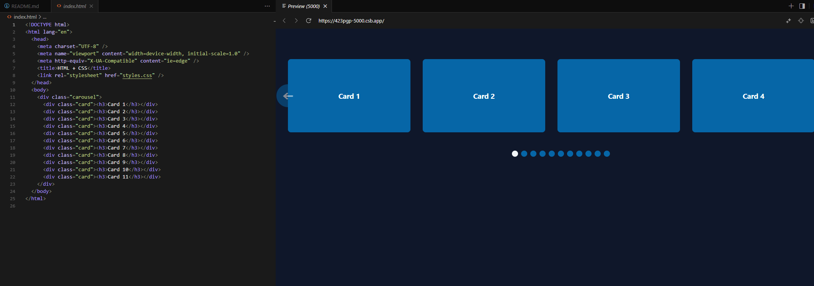

# Pure-CSS-Slider-2025

This is a pure CSS-Slider with 2025 features like Scroll-Snap-Type, Scroll-Marker-Group, Disabled State and more. Fully supports all mayor browers while providing lightweight handling in the DOM.

## usage

All you need is a wrapper div.carousel with some items with item.card in it - that's it.
Preferarbly .card items should be a div or a list-item.

## screenshot

<text-center>Enjoy</text-center>
